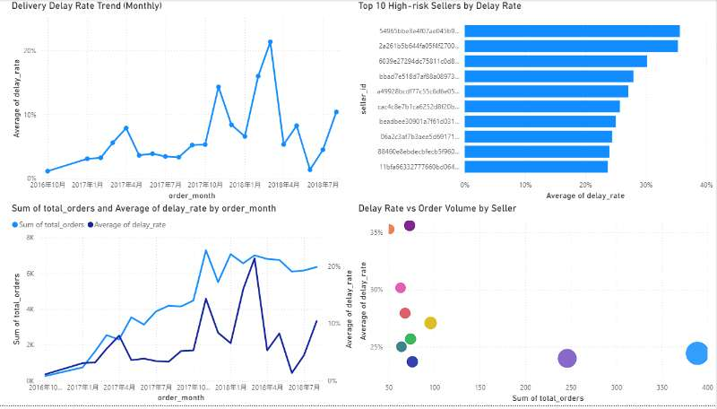
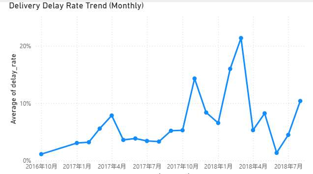
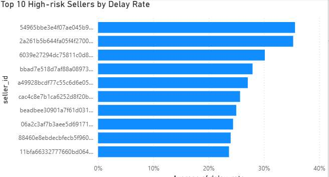
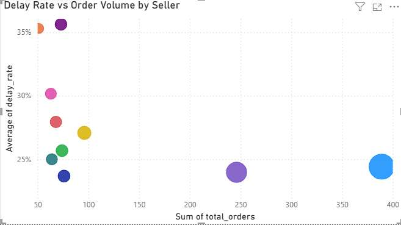

# 📊 E-commerce Delivery Delay Analysis

## 📌 Project Overview

This project analyzes delivery performance in an e-commerce dataset, focusing on identifying delay patterns and high-risk sellers.

The goal is to answer key business questions:

* How often do delivery delays occur?
* Which sellers contribute most to delays?
* Does order volume impact delivery performance?

---

## 🗄️ Dataset Description

The original dataset consists of multiple relational tables, including:

orders, order_items, customers, payments, and products.

These tables were joined and analyzed using SQL.

For this project, only aggregated datasets are included:

delay_trend.csv → monthly delay rate
seller_analysis.csv → seller-level performance

---

## 🛠️ Tech Stack

* SQL (MySQL / DataGrip)
* Power BI
* Python (optional)

---

## 📂 Project Structure

```
ecommerce-delay-analysis/
│
├── data/
│   ├── delay_trend.csv
│   └── seller_analysis.csv
│
├── sql_analysis/
│   └── analysis.sql
│
├── powerbi_dashboard/
│   └── delay_analysis_dashboard.pbix
│
├── images/
│   ├── delay_trend.png
│   ├── high_risk_sellers.png
│   ├── scatter_plot.png
│   └── dashboard_overview.png
│
└── README.md
```

---

## 📊 Dashboard Overview



---

## 📈 Key Visualizations

### 1. Delivery Delay Rate Trend



**Insight:**

* Delay rate fluctuates over time
* Indicates unstable logistics performance

---

### 2. Top 10 High-risk Sellers



**Insight:**

* A small number of sellers contribute disproportionately to delays
* These sellers are key targets for optimization

---

### 3. Order Volume vs Delay Rate



**Insight:**

* Delay rate varies significantly across sellers
* Some high-volume sellers still have high delay rates
* These sellers represent major operational risks

---

## 🔍 Key Findings

* Delivery performance is uneven across sellers
* High delay rates are concentrated among specific sellers
* Order volume alone does not explain delay performance

---

## 💡 Business Impact

This analysis helps:

* Identify high-risk sellers
* Improve logistics efficiency
* Support data-driven operational decisions

---

## 🚀 Future Improvements

* Build delay prediction model
* Develop seller performance scoring system
* Add real-time monitoring dashboard

## 🧠 SQL Highlights

Key techniques used in this project:

- JOIN multiple tables to integrate order, customer, and payment data
- CASE WHEN to classify delayed vs on-time deliveries
- Aggregation (SUM, COUNT, GROUP BY) for KPI calculation
- Window functions (for cumulative analysis, if used)

